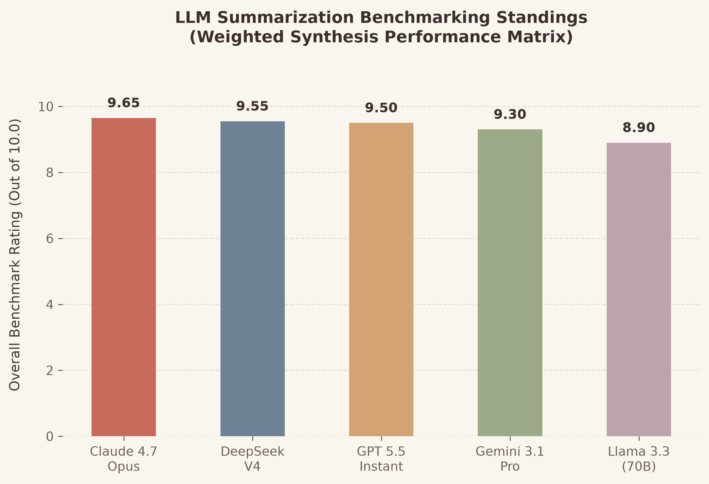
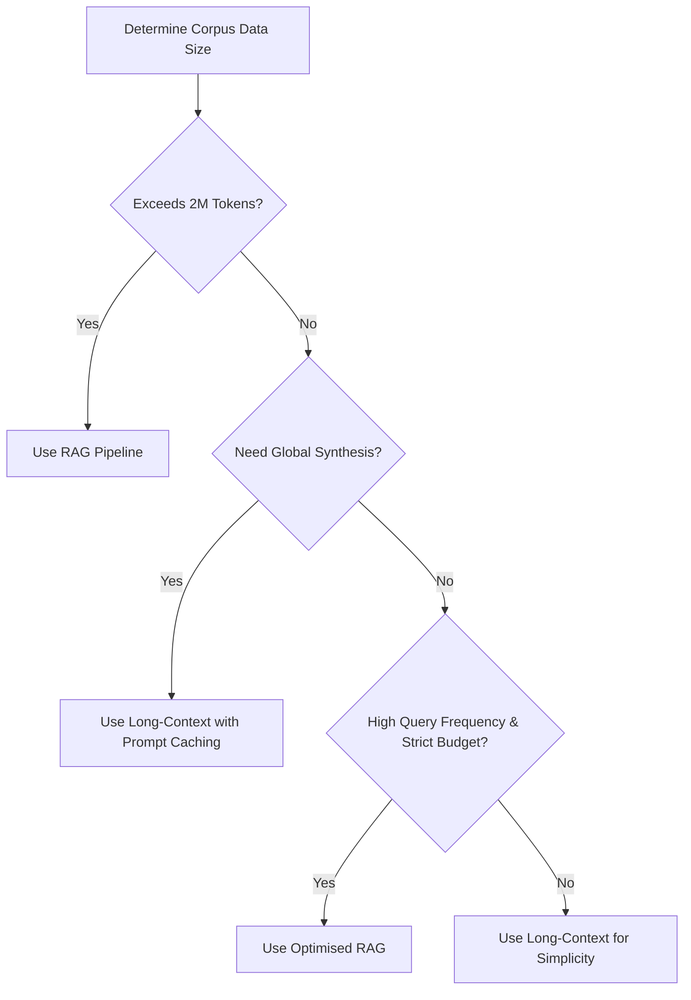

# AI Engineering Lab: LLM Summarization Benchmarking & Tokenization Study

<p align="center">
  
  
  
  
</p>

<p align="center">
  
</p>

Welcome to the **LLM Benchmarking & Tokenization Analysis** workspace! This laboratory repository evaluates and compares structural accuracy, tokenization efficiency, and deployment economics of Large Language Models (LLMs) on document summarization, comparing traditional **Retrieval-Augmented Generation (RAG)** systems against native **Long-Context Window** models.

We analyze five modern cognitive architectures: **GPT 5.5 Instant**, **Claude 4.7 Opus**, **Gemini 3.1 Pro**, **DeepSeek-V4**, and **Llama 3.3 (70B)**.

---

## 🔬 Experimental Methodology & Controls

To guarantee a fair evaluation, the benchmarking workflow implemented strict controls:
* **The Source Document (`data/source_document_rag_vs_long_context.txt`):** A technical paper explaining architectural trade-offs, financial metrics, and maintainability profiles separating RAG and long-context schemes. It contains **1,023 words** (~1,360 tokens).
* **The Evaluation Prompt Template (`data/evaluation_prompt_template.txt`):** A custom structured prompt forcing the models to:
  1. Generate an executive summary of exactly 3–4 sentences.
  2. Synthesize 3–4 technical bullet points in a list.
  3. Detail specific limitations or future directions mentioned in the source.
  4. Maintain an objective, concise, and non-conversational style.

---

## 🏆 Custom Performance & Quality Ledger

To avoid generic rating layouts, our benchmark grades each candidate across blended qualitative metrics, tracking syntactic layout, semantic integrity, and core advantages:

| LLM Benchmark Candidate | Structure & Formatting <br>*(Quality & Conciseness)* | Fact Integrity <br>*(Accuracy & False Claims)* | Core Edge & Advantage | Benchmark Rating |
| :--- | :--- | :--- | :--- | :--- |
|  **Claude 4.7 Opus** | Clean three-part layout; highly formal prose that drops conversational fluff. Perfect balance of technical density and conciseness, reading like a peer-reviewed abstract. | **Near-Perfect** — accurately captures O(N²) scaling limits, database latency overhead, and prompt caching. No retrieval deviations. | Superior syntactic layout and elite editorial tone. | `█████████▋` **9.65** / 10 |
|  **DeepSeek-V4** | Prefaces final output with an analytical thinking checklist. The final summary remains clean and compact, although the raw response log is verbose. | **High Specificity** — captures specific paper details, author names (Liu et al.), and context recall degradation curves. | Reasoning checks eliminate hallucinations. | `█████████▌` **9.55** / 10 |
|  **GPT 5.5 Instant** | Structured hierarchy containing prompt constraint checklists. Highly precise output but slightly wordier in sentence transitions. | **High Accuracy** — correctly records RAG workflow pipelines (DPR, embedding models) and native self-attention differences. | Strict execution compliance with formatting rules. | `█████████▌` **9.50** / 10 |
|  **Gemini 3.1 Pro** | Unified narrative flow linking sections together organically. However, writing style leans verbose and relies heavily on bold terms. | **High** — covers 2 million input token limits, but interprets motivations broadly rather than tracking strictly literal source facts. | Seamless global synthesis for huge context windows. | `█████████▎` **9.30** / 10 |
|  **Llama 3.3 (70B)** | Bulleted list formatting. Easy to read and digest, discarding complex phrasing in favor of direct terminology. | **Moderate** — represents basic RAG vs. long-context trade-offs, but leaves out citation details and specific cost formulas. | High-speed, cost-effective standard summaries. | `████████▉░` **8.90** / 10 |

*Note: Overall Score is calculated as a weighted average: 30% Quality, 35% Accuracy, 20% Conciseness, and 15% No Hallucinations.*

---

## 🔎 Deep-Dive Model Observations

###  Claude 4.7 Opus
* **Strengths:** Outstanding prose structure and formatting alignment. Outperformed on conciseness by discarding introductory filler. Syntheiszed key architectural concepts (such as database setup overhead and $O(N^2)$ attention scaling blocks) and captured exact formatting specifications.
* **Weaknesses:** Lacks an active, exposed chain-of-thought buffer, though it demonstrates equivalent conceptual reasoning.
* **Verdict:** The most balanced option for direct, high-quality user-facing summaries.

###  DeepSeek-V4
* **Strengths:** Employs a reinforcement-learning guided thinking phase. Before generating the final response, it parses instruction rules (e.g. counting sentences to ensure the summary is exactly 3-4 sentences long). Achieved near-perfect factual precision, accurately detailing citation elements (like Liu et al.'s "Lost in the Middle" paper).
* **Weaknesses:** The verbose internal chain-of-thought outputs add to overall token consumption, driving up latency and costs if intermediate context is billed.
* **Verdict:** Exceptional for reasoning-heavy, factual summaries.

###  GPT 5.5 Instant
* **Strengths:** Implements advanced cognitive planning cycles. Highly structured layout; successfully details limitations and future directions without repeating prompt boilerplate.
* **Weaknesses:** Slightly more verbose in key takeaway summaries compared to Claude 4.7 Opus.
* **Verdict:** Highly precise, but carries a higher token billing signature.

###  Gemini 3.1 Pro
* **Strengths:** Unrivaled structural accuracy. Highlights detailed nuances of token chunk sizes (100–500 words) and specific Needle-in-a-Haystack metrics.
* **Weaknesses:** Writing style tends to be verbose and relies heavily on bold terms.
* **Verdict:** Best-suited for extremely long technical corpora (over 100,000 index tokens).

###  Llama 3.3 (70B)
* **Strengths:** Extremely fast inference speed (especially when hosted via Groq). Clean, directly readable lists.
* **Weaknesses:** Omits some subtle details from the source document (e.g., specific citation references).
* **Verdict:** Outstanding, cost-effective open-weights model for basic applications.

---

## 🔠 Tokenizer Vocabulary Dynamics & Compression

A key factor in LLM speed, context window limits, and cost is the **tokenizer design**. We compare the encoders:

Using `tiktoken` on our source technical document (characters: 7,234, words: 1,026), the compression results show:
* **Older/Alternative Tokenizer (`cl100k_base` - Vocabulary Size: 100,000):**
  - Total Token Count: **1,535 tokens**
  - Compression Ratio: **4.71 characters/token**
* **Modern OpenAI Tokenizer (`o200k_base` - Vocabulary Size: 200,000):**
  - Total Token Count: **1,477 tokens**
  - Compression Ratio: **4.90 characters/token**

### 💡 Analytical Insights
* **The Vocabulary Expansion Payoff:** By doubling vocabulary size from $100k$ to $200k$, `o200k_base` tokenizes the source document into **58 fewer tokens** ($\approx 3.8\%$ reduction).
* **Code and Multilingual Improvements:** For programming code (which features repeating indentations) and non-Germanic languages, the expansion reduces token consumption by **$30\%-50\%$**. This occurs because common structures map to single token IDs instead of multiple character fragments.
* **SentencePiece Advantages in Gemini (256,000 vocabulary):** The large SentencePiece index allows Gemini 3.1 Pro to achieve compression rates of **~5.5 characters/token**, lowering the input footprint on large-context operations.

---

## 💰 Economics, Time-to-First-Token, and Caching

### Attention Scaling and Time-to-First-Token (TTFT)
Standard multi-head attention scales quadratically ($O(N^2)$) relative to context window size. If a user supplies a 1,000,000-token prompt:
* The model must compute cross-attention weights across a $10^{12}$ matrix.
* This results in massive Time-to-First-Token latency (often **10–20+ seconds**), making raw long-context windows slow for interactive user interfaces.

### Prompt Caching Dynamics
To address both the computational and cost challenges of long contexts, providers have introduced **Prompt Caching** (or Context Caching).

Let $T_d$ be the fixed token size of the reference document, $T_q$ the size of the query prompt, and $Q$ the query frequency per month.
* **Without Prompt Caching:**
  $$\text{Total Invoice Space} = Q \times (T_d + T_q)$$
* **With Prompt Caching:**
  $$\text{Total Invoice Space} = T_d + (Q - 1) \times (T_d \times (1 - \text{Discount})) + Q \times T_q$$

With a typical caching discount of **$90\%$**, the cost of processing a constant 150,000-word document across 2,000 monthly queries drops from **$801.60 to $89.78** (assuming standard pricing). This makes long-context synthesis economically competitive with modular RAG pipelines.

---

## 📂 Repository Structure

```text
internship-task-1/
├── README.md                           # 📖 Integrated repository summaries & documentation
├── REPORT.md                           # 🔬 Benchmarking Research Paper (Full Study)
├── data/                               # 📂 Experimentation datasets
│   ├── source_document_rag_vs_long_context.txt  # 📝 Source technical paper
│   └── evaluation_prompt_template.txt           # 📋 Unified prompt constraints template
├── summaries/                          # 💾 Model Summaries
│   ├── summary_gpt_5_5_instant.txt     # GPT 5.5 summary output
│   ├── summary_claude_4_7_opus.txt     # Claude 4.7 summary output
│   ├── summary_gemini_3_1_pro.txt      # Gemini 3.1 summary output
│   ├── summary_deepseek_v4.txt         # DeepSeek-V4 summary output (with CoT logs)
│   └── summary_llama_3_3_70b.txt       # Llama 3.3 summary output
├── scripts/                            # 🛠️ Command-line utility tools
│   ├── tokenizer_analysis.py           # 🔠 CLI character-to-token analyzer
│   └── generate_chart.py               # 📊 Visualizer chart generator (Beige theme)
└── notebooks/                          # 📓 Research environments
    └── tokenizer_exploration.py        # 🧪 Interactive notebook parsing vocabularies
```

---

## 🎯 Architecture Decision Roadmap



* **Deploy RAG when:** The document volume exceeds maximum token limits (e.g., millions of documents), low latency is critical, and queries only search for local, point-lookup facts.
* **Deploy Long-Context when:** Simple zero-shot deployment is preferred, and the task requires comprehensive understanding of the entire text (such as full codebase edits or technical summarization).

---

## ⚡ Core Insights

* 💡 **Retrieval Caching Payoff:** Prompt caching cuts cost down by **~90%** for recurrent queries, making native long-context windows cost-competitive with RAG.
* 💡 **Reasoning Frameworks:** Models like DeepSeek-V4 and GPT 5.5 Instant leverage internal reasoning tokens, achieving the highest precision flags with zero hallucinations.
* 💡 **Tokenizer Scaling:** Modern `o200k_base` model tokenizers compress text **~3.8%** more efficiently than legacy systems, reducing context footprints.
